## 🚩 목차

1. 프로젝트 소개
2. 기획 배경
3. 기능 소개
4. 사용 기술 & 아키텍쳐
5. 프로젝트 기획
6. 프로젝트 산출물
7. 프로젝트 회고
    

## ✨ 1. 프로젝트 소개

### 개요

- 한 줄 설명 : 수면에 어려움을 겪는 사람들에게 수면 분석을 통해 최적의 수면 환경과 개선 방법을 제안하는 서비스.

- 서비스명 : **Well Sleep**
- 인원 : 6인
- 기간 : 2024.10.14 ~ 2024.11.19
- 팀원 정보

| 이름   | 역할                |
| ------ | ------------------- |
| 정경원 | 팀장, Back-End, Infra      |
| 최용훈 | Back-End리더, 아두이노 |
| 한지훈 | Back-End, 아두이노     |
| 이용성 | Front-End리더, 아두이노       |
| 강경민 | Front-End, UX/UI           |
| 오예진 | Front-End, UX/UI           |

### 기능

| 항목               | 내용                                                                                                             |
| ------------------ | ---------------------------------------------------------------------------------------------------------------- |
| **수면 분석 진행** | IoT 모듈을 통해 심박수, 산소포화도, 근전도를 실시간으로 측정하여 수면 깊이를 분석하고 수면 단계를 제공           |
| **수면 환경 분석** | 카페인 섭취량, 온도, 습도, 조도, 소음 등 수면 환경 요인이 수면 깊이에 미치는 영향을 분석하여 제공 후 피드백 제공 |
| **수면 통계 제공** | 수면 단계와 환경 요인의 데이터를 시각화해 통계로 제공.                                                           |
| **알람 기능**      | 사용자가 설정한 시간에 맞춰 알람을 제공하는 기본 기능                                                            |
| **별자리 운세**    | 사용자의 별자리에 따라 매일 운세를 제공                                                                          |
| **유튜브 추천**    | 수면에 도움을 주는 음악이나 릴렉싱 콘텐츠를 유튜브에서 추천 및 제공.                                             |

### 기대효과

- 사용자는 수면 데이터와 환경 분석을 통해 수면의 질을 개선할 수 있습니다.
- IoT 모듈과 연동해 심박수, 산소포화도, 근전도 등의 데이터를 손쉽게 확인하고 분석할 수 있어 편리합니다.
- 온도, 습도, 소음 등 수면 환경 정보를 분석하여 개선 방안을 제공합니다.
- 알람 기능을 통해 규칙적인 수면 습관을 형성할 수 있습니다.

### ✨ 기획 배경

### 페르소나

-**이름:** 한지훈 (27세, 남성, 불면증 환자)  
**배경:**  
한지훈씨는 직장인으로, 불규칙한 생활 패턴과 스트레스 때문에 불면증을 자주 겪고 있습니다. 밤새 뒤척이며 잠들기 어려운 날이 많아 일상생활에서 피로도가 높아지고 있습니다. 또한, 수면 클리닉과 병원에서의 전문적인 수면 분석은 비용이 너무 비싸고 접근성이 낮아 실질적인 해결책을 찾기 힘든 상황입니다.

**니즈:**

- 수면 패턴과 환경을 분석해 불면증의 원인을 파악하고 싶음.
- 수면의 질을 개선할 수 있는 구체적인 가이드 제공.
- 규칙적인 수면 리듬을 조절할 수 있는 알람 기능 필요.

**목표:**  
수면의 질을 높이고 불면증을 완화하여 일상생활의 에너지를 회복하는 것.

### 현 상황

- [불면증 환자 증가, 수면 부족이 건강에 미치는 영향](https://www.ytn.co.kr/_ln/0103_202408080833238626)
- [수면장애 100만명 시대…치료 필요성 인식해야](https://www.medicaltimes.com/Main/News/NewsView.html?ID=1157876)

## ✨ 3. 특화 기능 소개

### 수면 측정 IoT 모듈

이러한 센서 데이터를 기반으로 사용자의 수면 상태를 종합적으로 분석하고, 개선 방안을 제시할 수 있는 IoT 모듈을 구현했습니다.

- **사운드 센서**: 소음 데이터를 측정하여 수면 환경 분석에 활용 (모델: SZH-EK033)
- **근전도 센서**: 근육 활동 데이터를 실시간으로 측정하여 수면 단계 분석에 사용 (모델: SZH-GJD001)
- **온습도 센서**: 수면 환경의 온도와 습도를 모니터링하여 이상 환경을 파악 (모델: DHT11)
- **조도 센서**: 조명 강도를 측정하여 최적의 수면 환경 조성을 지원 (모델: GL5537)
- **산소포화도 센서**: 혈중 산소 농도를 측정하여 수면 상태를 분석 (모델: MAX30102)
- **심박수 센서**: 실시간 심박수를 모니터링하여 수면 중 스트레스 상태 분석 (모델: MAX30100 또는 MAX30102)
- **블루투스 모듈**: HM-10 센서를 사용하여 사용자의 앱과 BLE(Bluetooth Low Energy) 통신을 통해 데이터를 전송 및 수신 (모델: HM-10 Bluetooth 4.0 모듈)

HM-10 센서를 사용하여 사용자의 어플과 BLE 통신을 하며 데이터를 통신한다.

(IoT 모듈 사진 첨부 예정)

### 수면 측정

- IoT 모듈을 통하여 1분 주기로, 근전도, 심박수, 혈중 산소 포화도를 통해 수면 깊이 점수를 평가할 수 있다.
- 클라이언트는 전송받은 데이터를 1분마다 서버로 데이터 전송
- 데이터를 Redis 서버에 저장, 서버는 10분단위로, RDBMS에 저장
- IoT 모듈을 통해 조도, 온도, 습도, 소음 등 수면에 영향을 끼치는 요소들을 측정할 수 있다.
- 알람 기능
- 카페인, 알코올 섭취량을 통해 수면에 어떤 영향이 있는지 확인한다.

&emsp; 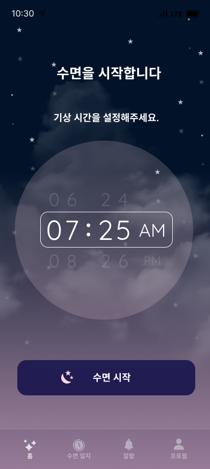 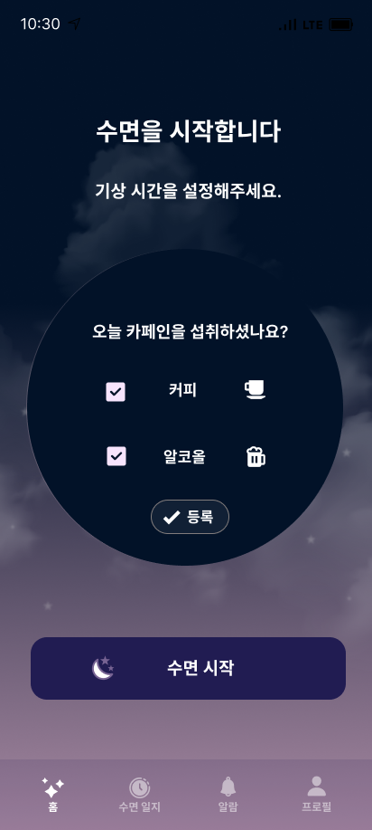 

### 수면 통계 제공

- 일별, 주별, 월별 수면 시간 및 수면 데이터를 시각화하여 제공한다.
- 평균 수면 깊이 점수와 수면 패턴을 분석해 사용자 맞춤형 피드백을 제공한다.
- 수면 환경(조도, 온도, 습도, 소음)과 수면 질의 연관성을 분석하여 통계로 제공한다.

&emsp; 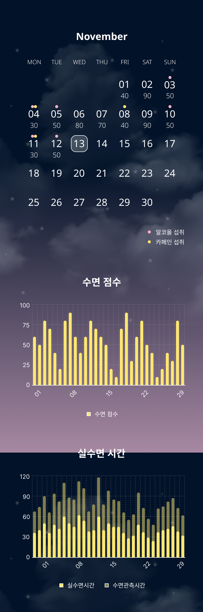 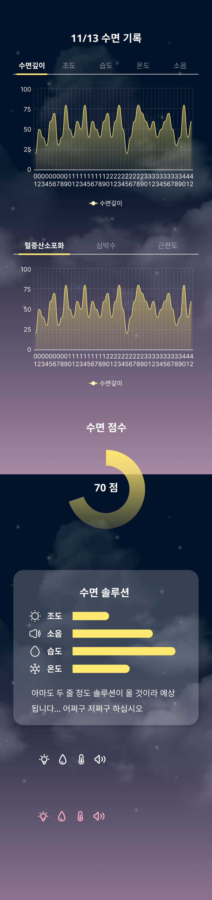 

| **알람 기능** | 사용자가 설정한 시간에 맞춰 알람을 제공하는 기본 기능 |
| **별자리 운세** | 사용자의 별자리에 따라 매일 운세를 제공 |
| **유튜브 추천** | 수면에 도움을 주는 음악이나 릴렉싱 콘텐츠를 유튜브에서 추천 및 제공. |

## ✨ 4. 사용 기술 & 아키텍쳐

- **프론트엔드** : Arduino, React-Native, TypeScript, Styled-Components, Axios, Redux, Webview, Expo
- **백엔드** : SpringBoot, SpringSecurity, JPA, Oauth2.0, JWT, Swagger
- **DB** : MariaDB, Redis
- **인프라** : Docker, Nginx, Jenkins, Ubuntu, EC2, S3
- **이슈 관리** : JIRA, GitLab, Notion

### 아키텍쳐

&emsp; 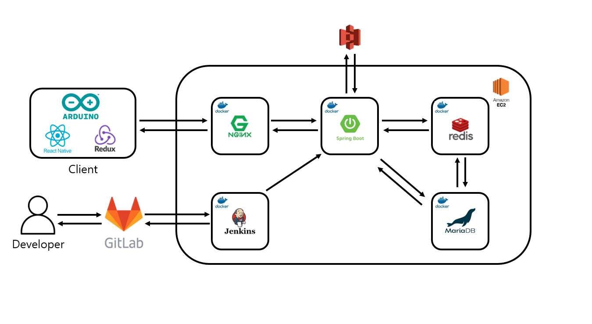

## ✨ 5. 프로젝트 기획

### 기능명세서

&emsp; 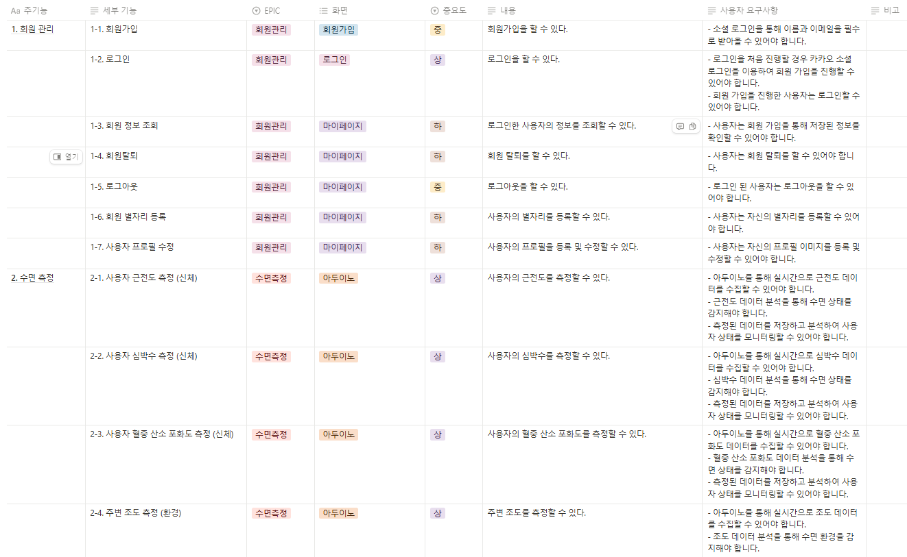 &emsp; 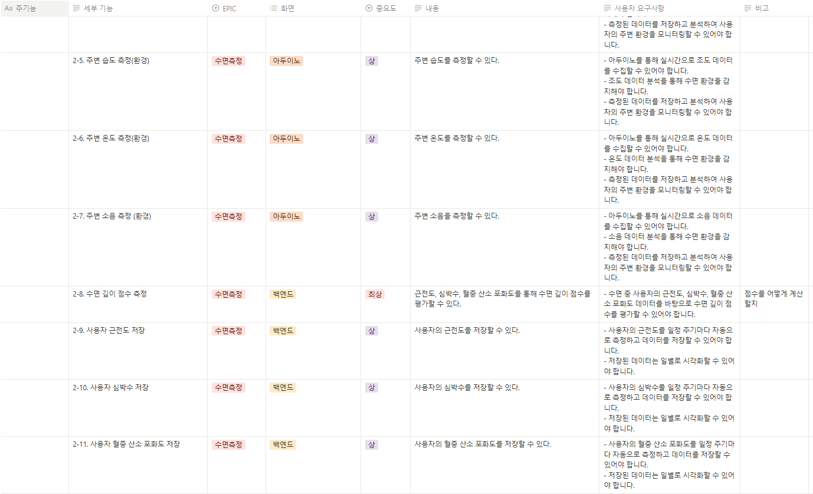
&emsp; 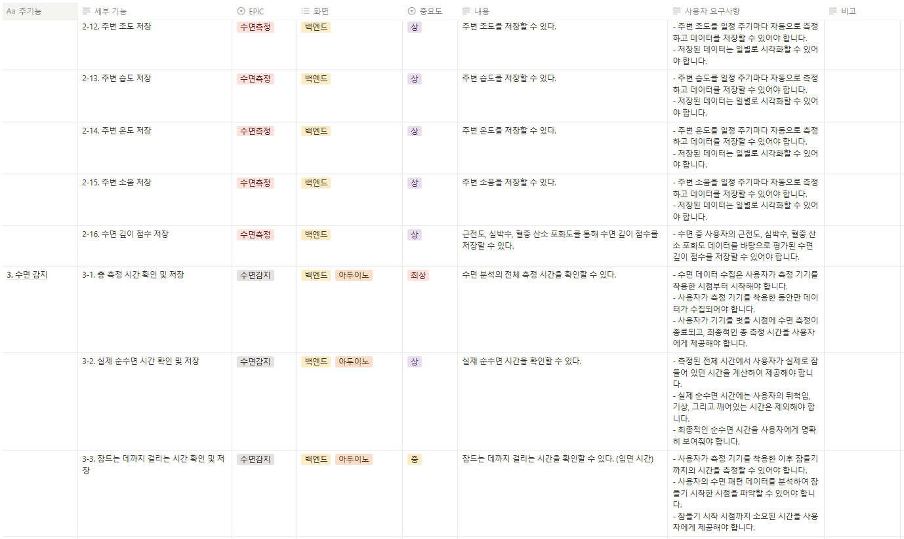 &emsp; 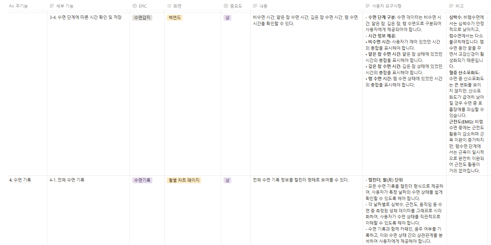
&emsp; 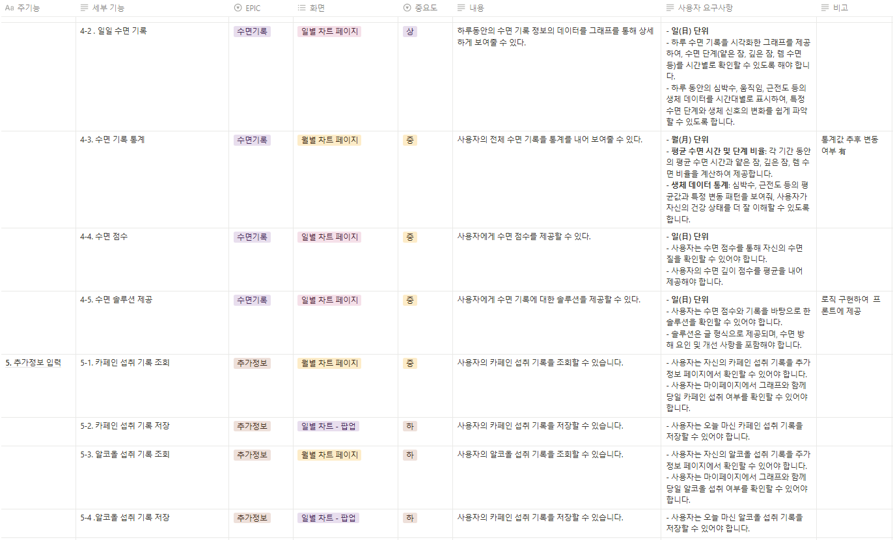 &emsp; 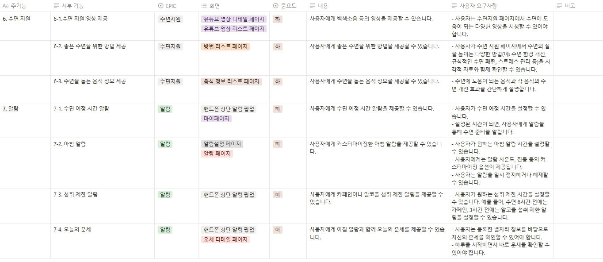

### API명세서

&emsp;  &emsp;  

### ERD

&emsp; &emsp; 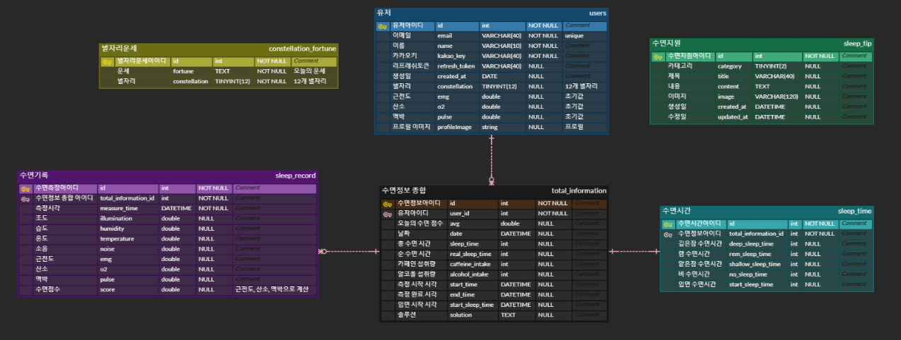

## ✨ 7. 프로젝트 회고

<table>
  <tr>
    <th style="text-align:center;"> 이름 </td>
    <th style="text-align:center;"> 역할 </td>
    <th style="text-align:center;"> 소감 </td>
  </tr>
  <tr>
    <td style="text-align:center;">
       정경원
    </td>
    <td style="text-align:center;">
      팀장, Back-End, Infra
    </td>
    <td>
      우선 프로젝트가 잘 마무리될 수 있도록 도와준 팀원들에게 감사하다는 말을 전하고 싶습니다. 엘라스틱 서치에 대해 학습하고 구현해본 것이 많이 유익했고, DB를 해킹당하면서 데이터 관리의 중요성에 대해 다시한번 체감하는 계기가 되었습니다. 이번 프로젝트를 통해 어떤 프로젝트라도 해낼 수 있다는 자신감이 생겼습니다.
    </td>
  </tr>
  <tr>
    <td style="text-align:center;">
       최용훈
    </td>
    <td style="text-align:center;">
      Back-End리더, 아두이노
    </td>
    <td>
      이번 프로젝트는 개인적으로도 큰 성장의 기회였고 팀원들과의 협업을 통해 기술적으로도 그리고 프로젝트 관리 측면에서도 많은 것을 배우고 익힐 수 있었습니다. 프로젝트를 마무리하며 느끼는 점은 기술적 지식뿐만 아니라 협업의 중요성과 사용자 관점에서의 서비스 기획의 중요성입니다. 앞으로도 이 경험을 바탕으로 지속적으로 배워나가며 더 나은 서비스를 제공할 수 있도록 노력하겠습니다.
    </td>
  </tr>
  <tr>
    <td style="text-align:center;">
       한지훈
    </td>
    <td style="text-align:center;">
      Back-End, 아두이노
    </td>
    <td>
      우선 모든 팀원들에게 기획부터 개발, 배포까지의 프로젝트 개발은 모두 고생했다고 말씀드리고 싶습니다.
좋은 팀원들 덕에 충분히 고민하고 배우는 시간을 가질 수 있어 한층 더 성장할 수 있었습니다. 
직접 GPU 서버에 생성형 AI를 학습시키고 배포하여 알약인식시스템을 만들며, 정말 많은 것을 배웠습니다.
팀원분들 다들 고생하면서 프로젝트를 진행하였고, 그만한 결과까지 나와 만족해서 팀원분들께 정말 고맙다고 느꼈습니다.
    </td>
  </tr>
  <tr>
    <td style="text-align:center;">
       이용성
    </td>
    <td style="text-align:center;">
      Front-End 리더
    </td>
    <td>
      이번 프로젝트를 통해 멋진 팀원들과 함께 할 수 있어서 정말 좋았습니다. 각자의 아이디어와 열정을 공유하며 협력할 수 있었던 경험이 큰 힘이 되었습니다. 특히 PWA와 VITE를 처음 다뤄보는 것이었는데, 새로운 기술을 배우고 적용하는 과정이 매우 흥미로웠습니다. 처음에는 어려움이 많았지만, 팀원들과 함께 문제를 해결해 나가면서 많은 것을 배우고 성장할 수 있었습니다.
    </td>
  </tr>
  <tr>
    <td style="text-align:center;">
       강경민
    </td>
    <td style="text-align:center;">
      Front-End, UX/UI
    </td>
    <td>
      이번 프로젝트에서 오류를 해결하느라 다들 정말 고생 많았어요! 함께 문제를 해결하려고 애쓴 시간이 많이 기억에 남습니다. 여러 어려움 속에서도 끝까지 함께해주어서 감사했습니다. 모두 앞으로도 원하는 진로에서 좋은 성과 만들어나가길 바랍니다!
    </td>
  </tr>
  <tr>
    <td style="text-align:center;">
       오예진
    </td>
    <td style="text-align:center;">
      Front-End, UX/UI
    </td>
    <td>
      유능한 프론트 리더 덕분에 많은 것을 배울 수 있는 프로젝트였습니다. 코드의 가독성과 최적화 하는 것의 중요성을 알 수 있었고, 서로의 의견을 갈등 없이 반영하면서 할 수 있어서 재미있게 프로젝트를 진행할 수 있었습니다. 중간에 어려움이 있었지만, 서로 많은 도움을 주셔서 문제를 해결 할 수 있었습니다.
    </td>
  </tr>
</table>
  
